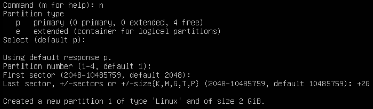
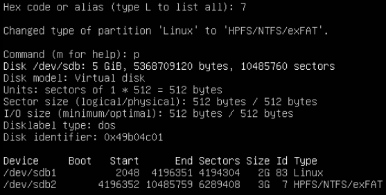
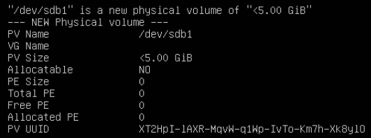
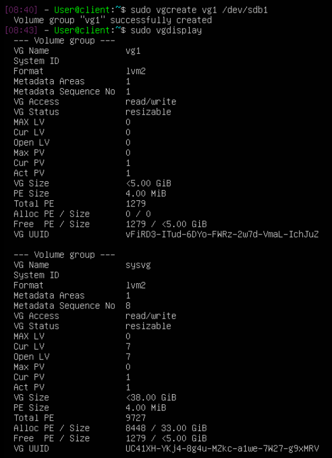

# **Exercice 1. Disques et partitions**

1 - Dans vshpere, sur la VM, cliquer sur actions > modifier les paramètres > ajouter un périphérique > Disque Dur. Spécifier 5 Go et passer le type à provisionnement dynamique.

2 - On peut utiliser la commande **lsblk** qui va lister les périphériques et donc les disques et partitions. Notre nouveau disque apparait bien en bas.

3 - On va créer une nouvelle partition avec **sudo fdisk /dev/sdb** (sdb qui est le nouveau disque que l'on a crée dans la première question de ce TP).
Ensuite, on la paramètre de la sorte:

Même mécanisme pour la seconde partition. Cela va créer une partition de 3Go de type linux. Il faut toutefois changer son type. Pour ce faire on utilise t, on entre le numéro de la partition (ici 2), et 7 comme hexcode.

On a donc bien nos deux partitions: linux de 2Go et NTFS de 3Go. On quitte avec w pour sauvegarder.

4 - Pour la partition linux: **sudo mkfs.ext4 /dev/sdb1**
Pour la partition ntfs: **sudo mkfs.ntfs /dev/sdb2**

5 - Cette commande ne peut pas fonctionner sur notre disque car le système de fichiers n'est pas encore monté.

6 - Ceci peut se faire à l'aide du fichier /etc/fstab qui liste les partitions qui seront montées automatiquement au démarrage. On va d'baord créer les points de montage **sudo mkdir /media/data ; sudo mkdir /media/win**. Ensuite, **sudo nano /etc/fstab** pour y ajouter nos deux partitions:
* /dev/sdb1 /media/data ext4  defaults 0 2
* /dev/sdb2 /media/win  ntfs  defaults 0 2
La première colonne spécifie la partition, la seconde indique le point de montage, la troisième le type de système de fichiers de la partition, ensuite default pour les options, 0 pour dump et en dernier 2 pour les autres partitions linux (car 1 c'est la partition principale)

7 - On va exécuter la commande **sudo mount -a** qui va permettre d'exécuter le fichier fstab comme si notre machine venait de démarrer.

8 - j'ai pas de clé usb

9 - OK

# **Exercice 2. Partitionnement LVM**

1 - **sudo umount /media/data** et **sudo umount /media/win** pour démonter les systèmes de fichiers dans /data et /win. **sudo nano /etc/fstab** pour aller retirer les deux lignes ajoutés dans la question 6.

2 - 

Les deux partitions ont bien été supprimées.
Pour créer la nouvelle partition LVM on procède de la même façon que pour la création des précédentes partitions, son hexacode est cette fois-ci 8e.

3 - **sudo pvcreate /dev/sdb1** => **sudo pvdisplay**

Le volume physique LVM a bien été crée.

4 - 

On a donc crée un groupe de volume, vg1, contenant pour l'instant uniquement le volume physique crée à l'étape précédente.

5 - Afin de créer un volume logique appelé lvData occupant l'intégralité de l'espace disque disponible on utilise la commande suivante : **sudo lvcreate -n lvData -l 100%FREE vg1**.

6 - On va d'abord créer la partition avec **sudo fdisk /dev/vg1/lvData** en laissant les paramètres par défaut. Ensuite on formate avec **sudo mkfs.ext4 /dev/bg1/lvData** puis on refait les mêmes étapes que dans la question 6 de l'exercice 1 pour qu'elle soit montée automatiquement.

7 - On suit les mêmes étapes que précedemment pour créer un nouveau disque. On peut vérifier avec **lsblk** qu'il a bien été crée. On répète encore une fois les manipulations faites dans les questions 2 et 3 de l'exercice 1.

8 - **sudo vgextend 
